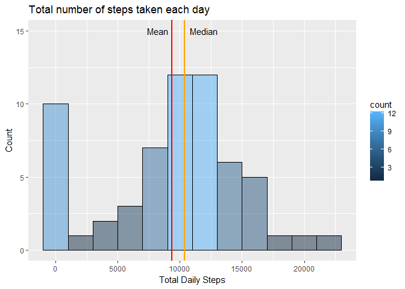
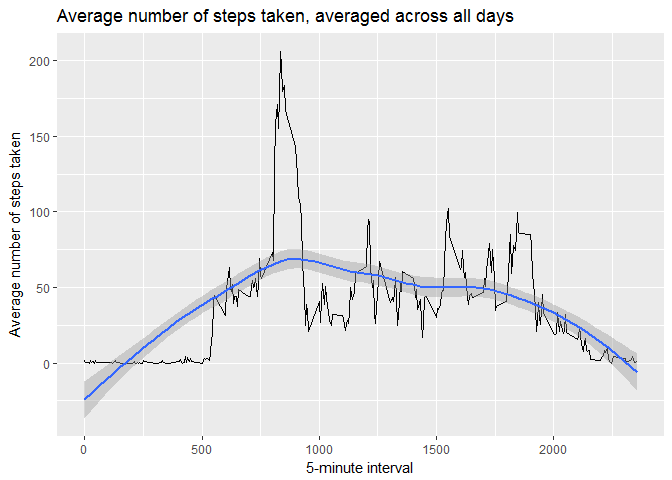
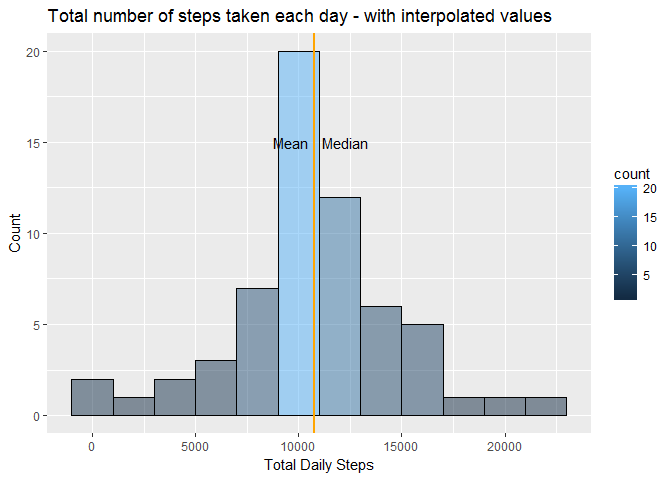
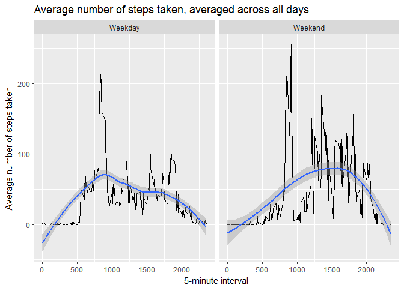

# PA1_template.Rmd
JM  
20 June 2017  


##Loading and preprocessing the data

First load the data


```r
url <- "https://d396qusza40orc.cloudfront.net/repdata%2Fdata%2Factivity.zip"

download.file(url,"Dataset")
unzip("Dataset")
data <- read.csv("activity.csv")
```

Then, check the first few rows of the data and the structure of the data frame.  


```r
head(data)
```

```
##   steps       date interval
## 1    NA 2012-10-01        0
## 2    NA 2012-10-01        5
## 3    NA 2012-10-01       10
## 4    NA 2012-10-01       15
## 5    NA 2012-10-01       20
## 6    NA 2012-10-01       25
```

```r
str(data)
```

```
## 'data.frame':	17568 obs. of  3 variables:
##  $ steps   : int  NA NA NA NA NA NA NA NA NA NA ...
##  $ date    : Factor w/ 61 levels "2012-10-01","2012-10-02",..: 1 1 1 1 1 1 1 1 1 1 ...
##  $ interval: int  0 5 10 15 20 25 30 35 40 45 ...
```

Convert the date to a character string (from a factor).


```r
data$date <- as.character(data$date)
str(data)
```

```
## 'data.frame':	17568 obs. of  3 variables:
##  $ steps   : int  NA NA NA NA NA NA NA NA NA NA ...
##  $ date    : chr  "2012-10-01" "2012-10-01" "2012-10-01" "2012-10-01" ...
##  $ interval: int  0 5 10 15 20 25 30 35 40 45 ...
```

##What is the mean total number of steps taken per day?

First, calculate the total number of steps taken each day i.e. aggregate by the date using tapply. Use "na.rm=T" to ignore na values. Check the head of the resulting data frame.


```r
stepsTotal <- data.frame("totalSteps"=tapply(data$steps,data$date,sum,na.rm=T))
head(stepsTotal)
```

```
##            totalSteps
## 2012-10-01          0
## 2012-10-02        126
## 2012-10-03      11352
## 2012-10-04      12116
## 2012-10-05      13294
## 2012-10-06      15420
```

Then, calculate the mean and median of the total number of steps taken per day


```r
stepsMean <- mean(stepsTotal$totalSteps,na.rm = T)
stepsMedian <- median(stepsTotal$totalSteps,na.rm=T)
```

The results are (to 2 decimal places):

mean = 9354.23

median = 10395

Finally, make a histogram of the total number of steps taken each day with the mean and median shown as vertical lines


```r
library(ggplot2)
h <- ggplot(data=stepsTotal, aes(stepsTotal$totalSteps)) 
h <- h + geom_histogram(binwidth=2000, 
                 col="black", 
                 aes(fill=..count..),
                 alpha = .5) 
h <- h + labs(title="Total number of steps taken each day",x="Total Daily Steps",y="Count")
h <- h + annotate("text",x=c(stepsMean-2000,stepsMedian+400),y=15,label=c("Mean","Median"),hjust=0)
h <- h + geom_vline(xintercept=stepsMean,colour="red",lwd=1,show.legend = T)
h <- h + geom_vline(xintercept=stepsMedian,colour="orange",lwd=1,show.legend = T)
h
```

<!-- -->


##What is the average daily activity pattern?

First, find the average number of steps taken in each 5 minute interval.


```r
stepsAverage <- data.frame("interval"=unique(data$interval),"averageSteps"=tapply(data$steps,data$interval,mean, na.rm=T))
head(stepsAverage)
```

```
##    interval averageSteps
## 0         0        1.717
## 5         5        0.340
## 10       10        0.132
## 15       15        0.151
## 20       20        0.075
## 25       25        2.094
```

Next, make a time series plot of the average number of steps taken for each of the 5-minute intervals, averaged across all days. Add a "geom_smooth" to show the general trend. 


```r
g <- ggplot(stepsAverage, aes(interval, averageSteps))
g <- g + geom_line() + geom_smooth() + labs(title="Average number of steps taken, averaged across all days",x = "5-minute interval", y = "Average number of steps taken") 
g
```

```
## `geom_smooth()` using method = 'loess'
```

<!-- -->

Finally, find the 5-minute interval, which on average across all the days in the dataset, contains the maximum number of steps


```r
maxSteps <- max(stepsAverage$averageSteps)
maxStepsInterval <- stepsAverage$intervals[which.max(stepsAverage$averageSteps)]
```

The 5-minute interval with the maximum average number of steps is 

##Imputing missing values

There are a number of days/intervals where there are missing values (coded as NA). The presence of missing days may introduce bias into some calculations or summaries of the data.

First, calculate the total number of missing values in the dataset (i.e. the total number of rows with NAs)


```r
sum(is.na(data$steps))
```

```
## [1] 2304
```

I will use the mean for each 5 minute interval to replace the na values.


```r
data2 <- merge(data,stepsAverage, by="interval",all.x=T)
data2$newSteps <- ifelse(is.na(data2$steps),data2$averageSteps,data2$steps)
```

Re-check the number of na values


```r
sum(is.na(data2$newSteps))
```

```
## [1] 0
```

Finally, plot a histogram of the total number of steps taken each day and Calculate and report the mean and median total number of steps taken per day. 


```r
stepsTotal2 <- data.frame("totalSteps"=tapply(data2$newSteps,data2$date,sum))

stepsMean2 <- mean(stepsTotal2$totalSteps)
stepsMedian2 <- median(stepsTotal2$totalSteps)

h <- ggplot(data=stepsTotal2, aes(stepsTotal2$totalSteps)) 
h <- h + geom_histogram(binwidth=2000, 
                 col="black", 
                 aes(fill=..count..),
                 alpha = .5) 
h <- h + labs(title="Total number of steps taken each day - with interpolated values",x="Total Daily Steps",y="Count")
h <- h + annotate("text",x=c(stepsMean2-2000,stepsMedian2+400),y=15,label=c("Mean","Median"),hjust=0)
h <- h + geom_vline(xintercept=stepsMean2,colour="red",lwd=1,show.legend = T)
h <- h + geom_vline(xintercept=stepsMedian2,colour="orange",lwd=1,show.legend = T)
h
```

<!-- -->

Do these values differ from the estimates from the first part of the assignment? What is the impact of imputing missing data on the estimates of the total daily number of steps?

The results are (to 2 decimal places):

Statistic| Original | With Imputed Missing Values
------------- | ------------- |-------------
Mean |9354.23|10766.19
Median|10395|10766.19

Imputing the missing data has increased both the mean and the median. 

##Are there differences in activity patterns between weekdays and weekends?

First, create a new factor variable in the dataset with two levels - "weekday" and "weekend" indicating whether a given date is a weekday or weekend day. To do this, convert the date to POSIX format then create a new factor "dateType".


```r
data2$date <- as.POSIXlt(data2$date,tz="",format="%Y-%m-%d")
data2$dateType <- as.factor(ifelse(weekdays(data2$date)=="Saturday" | weekdays(data2$date)=="Saturday","weekend","weekday"))
```

Next, make a panel plot containing a time series plot of the average number of steps taken in each 5-minute interval, averaged across all weekday days or weekend days (y-axis). 


```r
library(reshape2)
stepsAverage2 <- data.frame("intervals"=unique(data2$interval),"averageSteps"=tapply(data2$newSteps,list(data2$interval,data2$dateType),mean))
stepsAverage2 <- melt(stepsAverage2,id="intervals")
levels(stepsAverage2$variable) <- c("Weekday","Weekend")
g <- ggplot(stepsAverage2, aes(intervals, value))
g <- g + geom_line() + geom_smooth() + facet_grid(. ~ variable)
g <- g + labs(title="Average number of steps taken, averaged across all days",x = "5-minute interval", y = "Average number of steps taken") 
g
```

```
## `geom_smooth()` using method = 'loess'
```

<!-- -->
